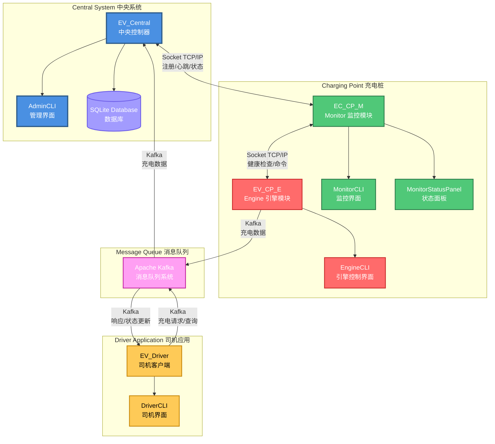
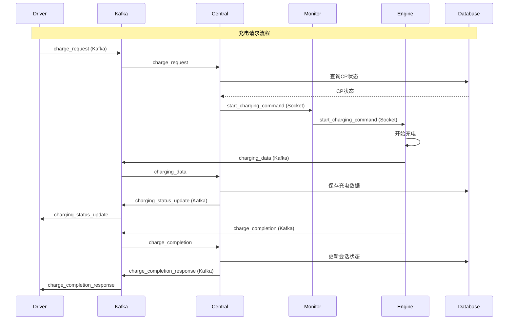
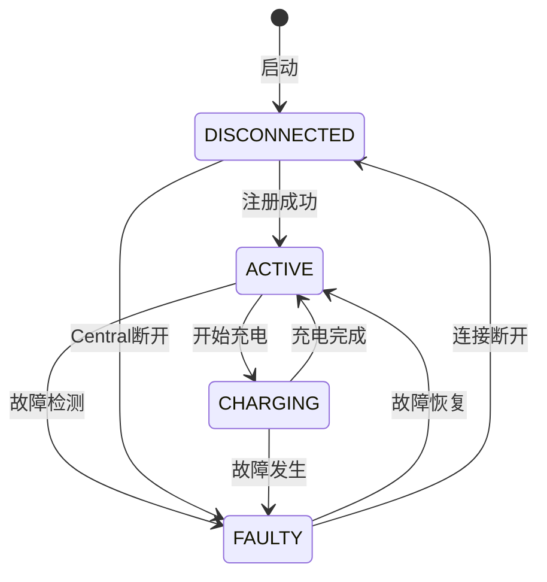
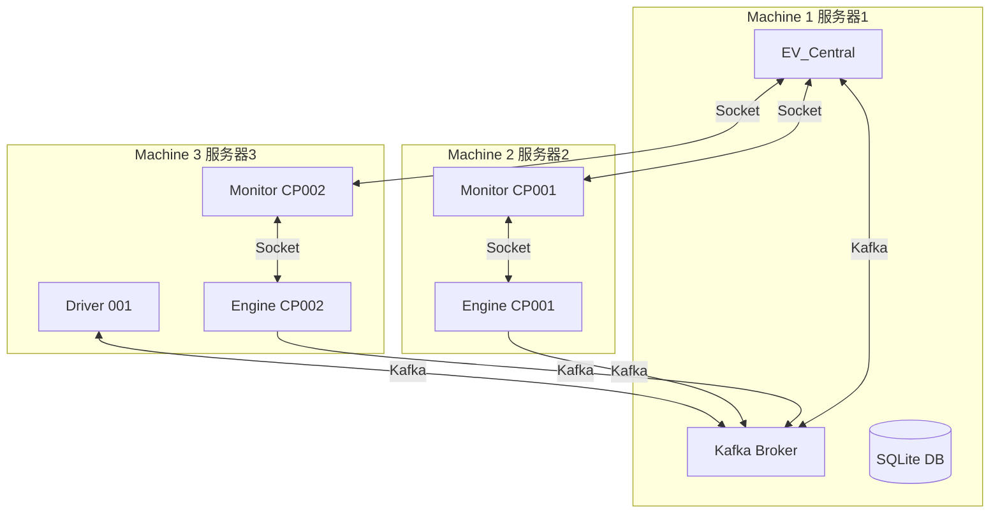

# EV Charging System - 系统架构图

## 系统整体架构

## 通信协议详细说明

### 1. Socket通信 (TCP/IP)

**Central ↔ Monitor**
- 协议: TCP/IP Socket
- 端口: 可配置（默认5000）
- 消息类型:
  - `auth_request/auth_response` - 认证
  - `register_request/register_response` - 注册
  - `heartbeat_request/heartbeat_response` - 心跳（每30秒）
  - `status_update` - 状态更新
  - `fault_notification` - 故障通知
  - `start_charging_command` - 启动充电命令
  - `stop_charging_command` - 停止充电命令
  - `charging_data` - 充电数据（Monitor转发）

**Monitor ↔ Engine**
- 协议: TCP/IP Socket
- 端口: 动态分配（Engine监听，Monitor连接）
- 消息类型:
  - `init_cp_id` - 初始化CP_ID
  - `health_check_request/health_check_response` - 健康检查（每30秒）
  - `start_charging_command` - 启动充电命令
  - `stop_charging_command` - 停止充电命令
  - `charging_data` - 充电数据（Engine → Monitor）
  - `charge_completion` - 充电完成通知

### 2. Kafka消息队列

**Driver ↔ Central**
- Topics:
  - `driver_charge_requests` - 充电请求
  - `driver_stop_requests` - 停止充电请求
  - `driver_cps_requests` - 查询可用充电桩
  - `driver_responses` - 统一响应主题（包含所有Driver响应）

**Engine → Central**
- Topics:
  - `charging_session_data` - 实时充电数据
  - `charging_session_complete` - 充电完成通知

## 数据流图

## 组件详细说明

### Central (EV_Central)
- **职责**: 中央控制系统，协调所有组件
- **功能**:
  - 管理充电点注册和状态
  - 处理司机充电请求
  - 管理充电会话
  - 数据持久化（SQLite）
  - 提供管理界面（AdminCLI）
- **通信方式**:
  - Socket服务器（监听Monitor连接）
  - Kafka生产者/消费者（与Driver和Engine通信）

### Monitor (EC_CP_M)
- **职责**: 监控充电桩健康状态，作为Central和Engine之间的桥梁
- **功能**:
  - 连接Central并注册充电点
  - 向Central发送心跳（每30秒）
  - 监控Engine健康状态（每30秒检查）
  - 转发Central的命令到Engine
  - 转发Engine的数据到Central
  - 故障检测和报告
- **通信方式**:
  - Socket客户端（连接到Central）
  - Socket客户端（连接到Engine）

### Engine (EV_CP_E)
- **职责**: 实际执行充电逻辑
- **功能**:
  - 接收Monitor的充电命令
  - 执行充电过程（模拟）
  - 发送实时充电数据（通过Monitor和Kafka）
  - 发送充电完成通知
  - 提供CLI模拟车辆操作
- **通信方式**:
  - Socket服务器（等待Monitor连接）
  - Kafka生产者（发送充电数据到Central）

### Driver (EV_Driver)
- **职责**: 司机客户端应用
- **功能**:
  - 查询可用充电桩
  - 发送充电请求
  - 查看充电状态
  - 查看充电历史
  - 停止充电请求
- **通信方式**:
  - Kafka生产者/消费者（与Central通信）

## 状态管理

## 部署架构

## 技术栈

- **编程语言**: Python 3.8+
- **消息队列**: Apache Kafka
- **数据库**: SQLite
- **通信协议**: 
  - TCP/IP Socket (Central ↔ Monitor ↔ Engine)
  - Kafka消息队列 (Driver ↔ Central, Engine → Central)
- **并发处理**: 多线程
- **UI框架**: Rich (CLI界面)

## 扩展性设计

1. **水平扩展**: 可以启动任意数量的CP和Driver实例
2. **解耦设计**: 使用Kafka实现异步通信，降低组件耦合
3. **故障恢复**: 
   - Monitor心跳机制（每30秒）
   - Engine健康检查（每30秒，超时90秒）
   - ConnectionManager自动重连
4. **状态管理**: 明确的状态转换逻辑，支持故障恢复

